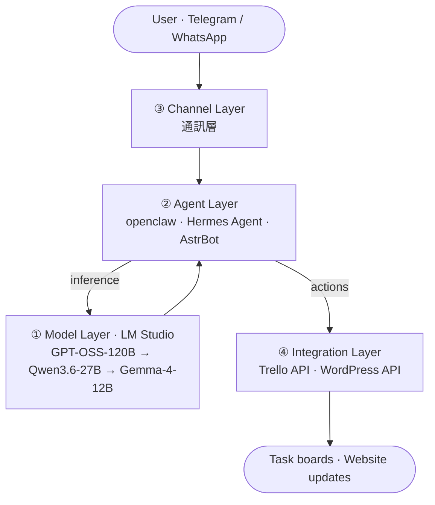

# 🤖 Self-Hosted Agentic AI System　自建多層式 Agentic AI 系統

> A conversation-driven, locally-hosted multi-tier AI agent platform — from local LLM inference to agent orchestration to messaging channels to external API automation.
> 對話驅動、地端推論的多層式 AI Agent 平台:從地端 LLM 推論 → Agent 編排 → 即時通訊介面 → 外部 API 自動化的完整閉環。


---

## 📖 Overview / 專案簡介

This project is a personal R&D platform that turns a chat message (Telegram / WhatsApp) into real actions — querying a local LLM, orchestrating agents, and driving external services such as **Trello** (task boards) and **WordPress** (personal site). It is designed to run **on-premise / locally**, keeping data private while still delivering useful automation.

本系統可將一則聊天訊息(Telegram / WhatsApp)轉化為實際動作 —— 呼叫地端 LLM、編排 AI Agent,並驅動 **Trello**(看板任務)與 **WordPress**(個人網站)等外部服務。整體以**地端**為核心,在資料不外洩的前提下提供自動化價值。

## 🏗️ Architecture / 系統架構



<details>
<summary>ASCII fallback / 純文字架構圖</summary>

```
[User] ──message──▶ ③ Channel  Telegram / WhatsApp
                         │
                         ▼
                 ② Agent  openclaw / Hermes Agent / AstrBot
                  (intent parsing · orchestration · tool calls)
                   │                          │
         ┌─────────┘                          └──────────┐
         ▼                                               ▼
① Model  LM Studio (local)                     ④ Integration  External APIs
   GPT-OSS-120B → Qwen3.6-27B → Gemma-4-12B        Trello API (boards/tasks)
   (tiered routing by task complexity)            WordPress API (build/edit site)
```
</details>

## 🧱 Layers / 分層說明

| Layer 層級 | Components 元件 | Role 角色 |
|---|---|---|
| **① Model 模型層** | LM Studio + GPT-OSS-120B / Qwen3.6-27B / Gemma-4-12B | Local inference; **tiered model routing** by task complexity (cost / latency trade-off). 地端推論、依任務複雜度分級調度模型。 |
| **② Agent 代理層** | openclaw · Hermes Agent · AstrBot | Intent parsing, task orchestration, tool/function calling. 意圖解析、任務編排、工具呼叫。 |
| **③ Channel 通訊層** | Telegram · WhatsApp | Conversational UI to issue commands and receive results. 對話式介面下指令、收結果。 |
| **④ Integration 整合層** | Trello API · WordPress API | Kanban task logging/assignment; create & edit the personal website. 看板任務記錄/分配;建立與修改個人網站。 |

## ✨ Features / 功能亮點

- 💬 **Conversational control** — drive everything from Telegram / WhatsApp.
- 🔒 **Local-first / private** — inference runs on-prem via LM Studio; sensitive data stays in-house.
- 🧠 **Tiered model routing** — route to a heavier or lighter open-weight model depending on the task.
- 🧩 **Agent orchestration** — modular agents (openclaw / Hermes / AstrBot) for intent → action.
- 📋 **Trello automation** — log, create, and assign tasks on a Kanban board.
- 🌐 **WordPress automation** — create and modify pages on the personal site via API.

## 🧰 Tech Stack / 技術棧

`Python` · `LM Studio` · open-weight LLMs (`GPT-OSS`, `Qwen`, `Gemma`) · AI agent frameworks (`openclaw`, `Hermes`, `AstrBot`) · `Telegram Bot API` · `WhatsApp` · `Trello REST API` · `WordPress REST API`

## 🚀 Getting Started / 快速開始

> ⚠️ Replace the placeholders below with your own configuration. **Never commit secrets** (API tokens, keys) — use a `.env` file and add it to `.gitignore`.

```bash
# 1) Clone
git clone https://github.com/jackycj0830/<repo>.git && cd <repo>

# 2) Create & activate a virtual environment
python -m venv .venv && source .venv/bin/activate    # Windows: .venv\Scripts\activate

# 3) Install dependencies
pip install -r requirements.txt

# 4) Configure (copy the template, then fill in your tokens)
cp .env.example .env
#   TELEGRAM_BOT_TOKEN=...
#   WHATSAPP_TOKEN=...
#   TRELLO_KEY=...        TRELLO_TOKEN=...
#   WORDPRESS_URL=...     WORDPRESS_APP_PASSWORD=...
#   LMSTUDIO_BASE_URL=http://localhost:1234/v1

# 5) Start LM Studio locally and load a model, then run
python main.py
```

## 🗺️ Roadmap / 後續規劃

- [ ] Add a **vector database + RAG** so agents can answer over personal documents.
- [ ] Add **memory / conversation state** across sessions.
- [ ] **Containerize** (Docker / docker-compose) for one-command deployment.
- [ ] Add **evaluation & monitoring** for model routing quality.
- [ ] Publish a short **demo video** and architecture write-up.

## 🔐 Note / 注意事項

This is a **personal research project**. Any enterprise/company-specific models, workflows, or data are intentionally excluded. Sanitize all configuration before making the repository public.
本專案為**個人研究**;任何公司專屬模型、工作流或資料皆已排除,公開前請務必清除所有機敏設定。

---

<sub>Built by **Jacky Zou (鄒嘉駿)** — AI Deployment × Enterprise Digital Transformation Engineer · [Portfolio](https://jackycj0830.github.io/) · [GitHub](https://github.com/jackycj0830)</sub>
